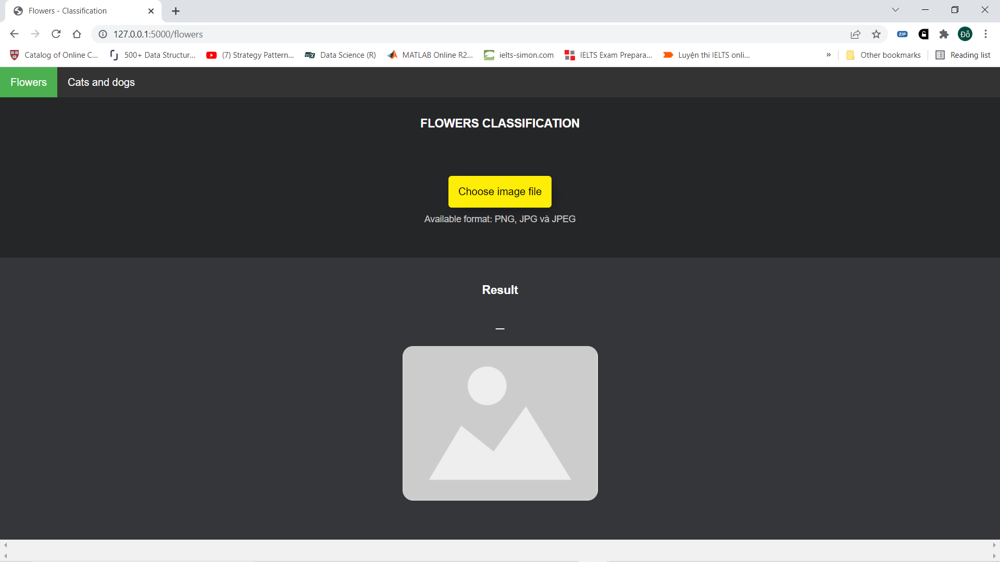
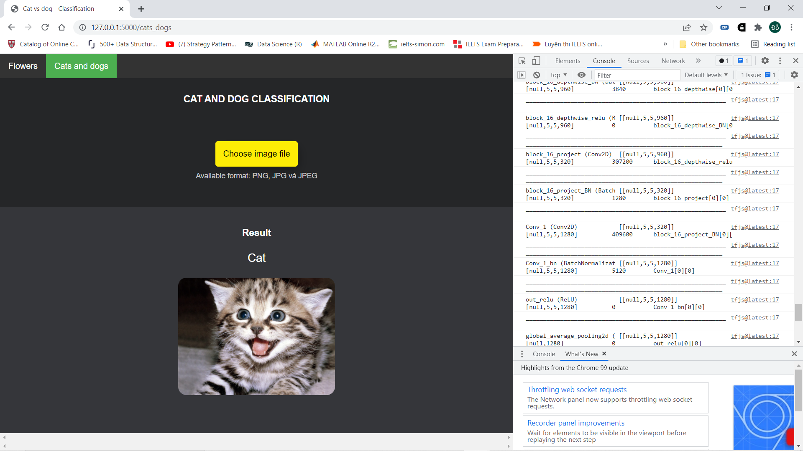

# Phân loại ảnh trên trang web sử dụng tensorflow.js và flask
Đây là project phân loại ảnh phân ra làm 2 phần chính: 
- Phân biệt chó, mèo. 
- Phân biệt 5 loài hoa: hoa cúc, hoa hồng, hoa hướng dương, bồ công anh và hoa tulip.

_Demo hệ thống_:

Phân biệt hoa             |  Phân biệt chó mèo
:-------------------------:|:-------------------------:
  |  

## Thiết lập
1. Clone project về máy:
```
 git clone https://github.com/DoDucNhan/Image_Classification.git
```

2. Cài đặt các thư viện cần thiết:
```bash
pip install -r requirements.txt
```

## Chạy chương trình
1. Chạy dòng lệnh.

```
python flask_web.py
```

2. Ấn vào địa chỉ ip local hiện lên hoặc copy địa chỉ và dán vào trình duyệt web. Sau đó chọn tác vụ phân biệt mà bạn muốn thông qua thanh điều hướng góc trên bên trái.


3. Ấn vào nút "chọn file ảnh" và chọn ảnh mà bạn muốn phân biệt. Bạn cũng có thể xem cấu trúc model bằng cách ấn nút F12.

Demo 1  |  Demo 2
:-------------------------:|:-------------------------:
  |  
