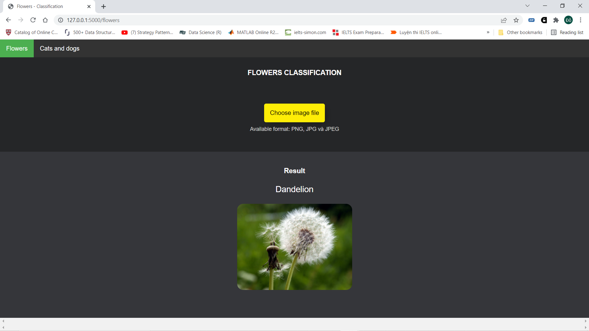

# Classifying images on webapp using tensorflow.js and flask
This is an image classifcation project consisting of two parts: 
- Classifying cat and dog. 
- Classifying 5 types of flowers: daisy, rose, sunflower, dandelion and tulip.

_Demo_:

Flowers classification             |  Cat and dog classification
:-------------------------:|:-------------------------:
  |  

## Setups
1. Clone the repository:
```
 git clone https://github.com/DoDucNhan/Image_Classification.git
```

2. Instal dependencies:
```bash
pip install -r requirements.txt
```

## Run project
1. Run the following command.

```
python flask_web.py
```

2. Click on the local ip address that shows in the image below or copy that address and paste it into your web browser. Then select the task you want to do via the upper left corner navigation bar.


3. Click the `Choose image file` button and select the image you want to classify. You can also view the model structure by pressing the _F12_ button.

Demo 1  |  Demo 2
:-------------------------:|:-------------------------:
  |  

## References
1. Create and train models with tensorflow:
- https://www.tensorflow.org/hub/tutorials/image_feature_vector
- https://www.tensorflow.org/tutorials/images/transfer_learning
2. Implement the model in the browser using tensorflow.js:
- https://www.youtube.com/watch?v=nAwW11yMjpQ&t=2341s
3. Web framework - Flask:
- https://blog.miguelgrinberg.com/post/the-flask-mega-tutorial-part-i-hello-world
